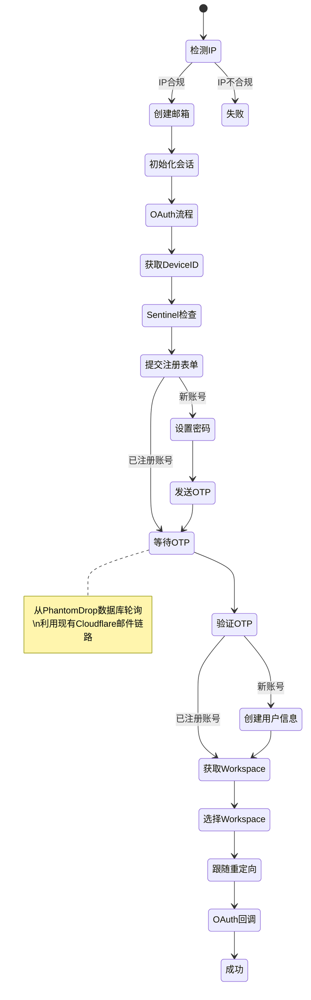

# 集成 OpenAI 自动注册工作流（三仓库综合方案）

综合借鉴 [CPACM](https://github.com/jeja2023/CPACM)、[codex-console](https://github.com/dou-jiang/codex-console) 和 [any-auto-register](https://github.com/lxf746/any-auto-register) 的工程化实现，在 PhantomDrop 中原生集成 OpenAI 账号自动注册功能。

## 三仓库核心要点提炼

| 维度 | CPACM (Python) | codex-console (Python) | any-auto-register (Python) |
|------|----------------|------------------------|---------------------------|
| HTTP 库 | `curl_cffi` | `curl_cffi` | `curl_cffi` |
| 注册模式 | 纯协议 | 纯协议（注册+登录分离） | 协议 + 浏览器可切换 |
| Sentinel PoW | ✅ SHA3-512 | ✅ 已集成 | ✅ 已集成 |
| Turnstile | 外部打码 | 打码平台集成 | 本地 Camoufox Solver |
| 邮箱服务 | 自建/Outlook | CloudMail/Outlook/临时邮箱 | MoeMail/Laoudo/Cloudflare/DuckMail |
| OAuth 流程 | PKCE + Token Exchange | PKCE + 分离登录 | PKCE + 统一回调 |
| 账号分发 | CPA/Sub2API | CPA/NewAPI | 仅本地持久化 |
| 架构特色 | 单模块 | 增强容错/三链路回退 | DDD 分层/插件注册表 |

## 用户审查确认

> [!IMPORTANT]
> **关键架构决策：纯 Rust 协议注册**
> 三个参考仓库均使用 Python + `curl_cffi`（模拟浏览器 TLS 指纹）。我们在 Rust 端将使用 `reqwest` + `rustls`。如果遭遇 TLS 指纹封锁，后续可能需要通过 `boring-tls` 或 FFI 调用 `curl` 来绕过。

> [!WARNING]
> **关于注册与登录分离**
> codex-console 的最核心贡献是：**注册成功后通常不会直接返回 token，需要二次登录拿 token**。我们的 Rust 实现将默认采用这种"注册 → 登录 → 取 token"的两阶段模式。

> [!IMPORTANT]
> **邮箱验证码获取策略**
> PhantomDrop 已集成 Cloudflare Email Worker → 后端的邮件收取链路。注册时验证码将**直接从 PhantomDrop 数据库轮询提取**，无需外部邮箱 API 调用，这是我们相比参考项目的原生优势。

## 拟议变更

### 1. 核心注册协议 (Rust Core — `core/src/openai/` 子模块)

---

#### [NEW] [mod.rs](file:///d:/project/PhantomDrop/core/src/openai/mod.rs)
- OpenAI 子模块入口，导出 `sentinel`、`oauth`、`register`、`uploader` 等子模块

#### [NEW] [constants.rs](file:///d:/project/PhantomDrop/core/src/openai/constants.rs)
- 移植 `any-auto-register` 的 `constants.py` 核心常量：
  - OAuth 参数：`CLIENT_ID = "app_EMoamEEZ73f0CkXaXp7hrann"`
  - API 端点：`sentinel`、`signup`、`register`、`send_otp`、`validate_otp`、`create_account`、`select_workspace`
  - 页面类型判断：`EMAIL_OTP_VERIFICATION`、`PASSWORD_REGISTRATION`
  - OTP 正则匹配模式：`(?<!\d)(\d{6})(?!\d)`
  - OpenAI 邮件发件人白名单
  - 随机用户信息生成（名字池 + 生日随机）

#### [NEW] [sentinel.rs](file:///d:/project/PhantomDrop/core/src/openai/sentinel.rs)
- 借鉴 `any-auto-register` 和 `codex-console` 的 Sentinel 通信逻辑：
  - 向 `https://sentinel.openai.com/backend-api/sentinel/req` 发送 `{p:"", id:"{did}", flow:"authorize_continue"}`
  - 请求头必须包含 `origin: https://sentinel.openai.com`
  - 解析返回的 `token` 字段作为 sentinel token
- 如果后续需要 PoW 求解（更高安全等级），预留 SHA3-512 求解接口

#### [NEW] [oauth.rs](file:///d:/project/PhantomDrop/core/src/openai/oauth.rs)
- 移植 `any-auto-register/platforms/chatgpt/oauth.py` 的完整 PKCE 流程：
  - `generate_oauth_url()` → 生成 `state`、`code_verifier`、`code_challenge(S256)`
  - 关键参数：`codex_cli_simplified_flow=true`、`id_token_add_organizations=true`
  - `handle_callback()` → 解析回调 URL、校验 state、Token Exchange
  - `jwt_claims_no_verify()` → 从 `id_token` 提取 `email`、`account_id`
  - `refresh_token()` → Token 刷新能力预留

#### [NEW] [register.rs](file:///d:/project/PhantomDrop/core/src/openai/register.rs)
- 综合 `codex-console` 和 `any-auto-register` 的注册引擎，实现完整注册流程：

  **第一阶段 — 注册**：
  1. `check_ip_location()` — 通过 `cloudflare.com/cdn-cgi/trace` 检测 IP 合规性
  2. `init_session()` + `start_oauth()` — 创建 `reqwest::Client` 并生成 OAuth URL
  3. `get_device_id()` — 访问 OAuth URL 获取 `oai-did` Cookie（最多 3 次重试 + UUID 兜底）
  4. `check_sentinel(did)` — 获取 sentinel token
  5. `submit_signup_form()` — 提交注册入口表单，包含 sentinel token 头
     - 解析 `page.type` 判断：新账号 → 密码注册 / 已注册 → OTP 自动登录
     - 429 限流自动重试（等待 5-18s）
  6. `register_password()` — 提交密码注册（`POST /api/accounts/user/register`）
  7. `send_verification_code()` — 触发 OTP 发送（`GET /api/accounts/email-otp/send`）
  8. `get_verification_code()` — **从 PhantomDrop 数据库轮询 OTP**（利用现有 Cloudflare 邮件链路）
  9. `validate_verification_code()` — 验证 OTP（`POST /api/accounts/email-otp/validate`）
  10. `create_user_account()` — 创建用户信息（随机姓名 + 生日）
  
  **第二阶段 — 登录获取 Token**（借鉴 codex-console 两段式设计）：
  11. 重新 `init_session` + `start_oauth` + `get_device_id` + `check_sentinel`
  12. `submit_login_start()` — 以 `screen_hint: "login"` 触发登录
  13. `submit_login_password()` — 提交密码（`POST /api/accounts/password/verify`）
  14. 等待并验证登录 OTP
  15. `get_workspace_id()` — 从 `oai-client-auth-session` Cookie 解码 JWT 获取 workspace
  16. `select_workspace()` — 选择 workspace 获取 `continue_url`
  17. `follow_redirects()` — 跟随重定向链寻找 OAuth callback URL
  18. `handle_oauth_callback()` — Token Exchange 获取 access_token / refresh_token / id_token

#### [NEW] [uploader.rs](file:///d:/project/PhantomDrop/core/src/openai/uploader.rs)
- 借鉴 `CPACM` 和 `codex-console` 的账号分发逻辑：
  - **CPA 上传**：`multipart/form-data` 格式，`Bearer Token` 认证
  - **Sub2API/NewAPI 上传**：`application/json` 格式，`x-api-key` 认证
  - 支持配置型开关控制是否启用

---

### 2. 数据持久化 (Rust Core)

#### [MODIFY] [Cargo.toml](file:///d:/project/PhantomDrop/core/Cargo.toml)
- 添加依赖：
  - `sha3` — PoW 计算（预留）
  - `base64` — JWT 解码 / PKCE
  - `hex` — 十六进制转码
  - `url` — URL 解析
  - `cookie_store` — Cookie 管理

#### [MODIFY] [db.rs](file:///d:/project/PhantomDrop/core/src/db.rs)
- 新增 `generated_accounts` 表字段扩展：
  - `access_token TEXT`
  - `refresh_token TEXT`
  - `id_token TEXT`
  - `session_token TEXT`
  - `device_id TEXT`
  - `workspace_id TEXT`
  - `account_id TEXT`
  - `upload_status TEXT` (none/cpa_ok/newapi_ok/failed)
  - `source TEXT` (register/login)

#### [MODIFY] [workflow.rs](file:///d:/project/PhantomDrop/core/src/workflow.rs)
- 新增 `WorkflowKind::OpenAIRegister`
- 实装真实注册逻辑替代当前的 `simulate_account_gen`
- `WorkflowParameters` 新增字段：
  - `proxy_url: Option<String>` — 代理地址
  - `concurrent: Option<usize>` — 并发数
  - `cpa_enabled: Option<bool>` — CPA 上传开关
  - `cpa_api_url: Option<String>`
  - `cpa_api_key: Option<String>`
  - `newapi_enabled: Option<bool>` — NewAPI 上传开关
  - `newapi_url: Option<String>`
  - `newapi_key: Option<String>`
- 注册完成后按配置触发 `uploader.rs` 分发
- 分发结果通过 SSE 实时推送到前端

#### [MODIFY] [parser.rs](file:///d:/project/PhantomDrop/core/src/parser.rs)
- 优化 OTP 提取逻辑：
  - 增加 OpenAI 发件人白名单匹配（`@openai.com`, `.openai.com`）
  - 增加语义模式匹配（`code is XXXXXX`、`验证码`）
  - 排除误识别（邮箱域名中的6位数字不应视为 OTP）

---

### 3. 前端界面 (React Web UI)

#### [MODIFY] 工作流配置页面
- 在工作流类型中增加 "OpenAI 批量注册" 选项
- 新增注册参数配置面板：
  - 目标批次数量
  - 代理地址
  - 并发数
  - CPA/NewAPI 上传开关及 API 配置
  - 打码平台 API KEY（预留）

---

### 4. OTP 轮询专用 API

#### [MODIFY] [main.rs](file:///d:/project/PhantomDrop/core/src/main.rs)
- 新增 `GET /api/otp/poll` 端点
  - 参数：`email`（目标邮箱地址）、`since`（时间戳，仅查新邮件）
  - 返回：从 `emails` 表中匹配 OpenAI 来源邮件，提取最新 6 位 OTP
  - 用于注册引擎内部调用（不依赖外部邮箱 API）

## 注册流程状态机

## 开放性问题

1. **TLS 指纹问题**：参考项目全部使用 `curl_cffi` 来模拟浏览器 TLS 指纹。Rust 的 `reqwest` + `rustls` 可能会被 OpenAI 识别。是否需要在首期就考虑通过 `boring-tls` 或 FFI 调用 `curl` 来绕过？还是先用标准方案试水？

2. **Turnstile 验证码**：如果注册过程中遇到 Cloudflare Turnstile 验证，是否需要首期就集成 YesCaptcha/2Captcha 等打码平台？还是先跳过，遇到时标记为失败？

3. **账号分发优先级**：CPA 和 NewAPI 上传功能是否需要在首期实装？还是先只做本地持久化？

## 验证计划

### 自动化测试
- `sentinel.rs` 单元测试：验证请求构造和响应解析
- `oauth.rs` 单元测试：验证 PKCE 生成、JWT 解析
- `register.rs` 集成测试：端到端注册流程（需代理 + 真实邮箱域名）
- `parser.rs` 单元测试：增加 OpenAI OTP 提取测试用例

### 手动验证
- 启动 PhantomDrop，触发 "OpenAI 批量注册" 工作流
- 通过系统流监控观察 SSE 实时输出
- 检查 `generated_accounts` 表中是否写入真实 OpenAI 账号（含 access_token）
- 如开启 CPA/NewAPI，检查目标服务是否成功接收数据
