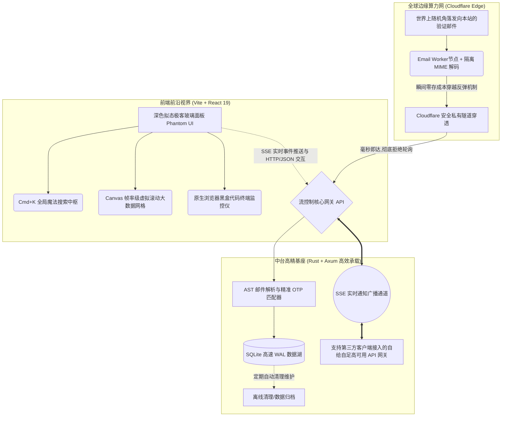

# PhantomDrop (幻影中台) - 无限自动化验证枢纽

*本项目代表了目前私有化邮箱接收端技术的最优形态，专为高并发、全自动的灰盒/黑盒自动化团队打造。*

## V0.0.35 落地状态

当前发布基线为 `V0.0.35`。Grok/xAI 协议注册在既有邮件中枢和工作流生命周期上新增三级收信域名回退、运行前就绪报告、浏览器参数发现回退与 Turnstile 级联容错；管理端会展示每项诊断并在硬失败时阻止启动。版本发布工具、开发认证代理和运行文档也已同步修复，不新增数据库迁移。

版本变更、部署步骤和质量门禁分别以 `更新日志.md`、`README.md` 和 `VERIFY.md` 为准。

---

## 🌌 顶层全景架构图 (Modern Architecture Graph)



---

## 🎨 前端前沿设计：极客美学与高性能视界 (Frontend Paradigm)

### 1. 极致交互与前沿视觉设计
- **极客暗黑风 (Dark Mode Glassmorphism)**：全站采用深邃的暗黑主题（纯黑与毛玻璃交织），辅以点阵背景和动态渐变边框，重塑一流操作台的终极质感。
- **全局命令中枢 (Command Palette - Cmd+K)**：完全面向 Power User（重度用户）的现代交互。按下 `Ctrl+K`，深色搜索框横空出世，您可以直接输入 `/gen 500`（生成500个邮箱），或者搜索发件人、主题与验证码，彻底告别繁琐的鼠标点击。

### 2. 百万级数据帧率级渲染 (Canvas-based Grid)
- **现代化解法**：采用基于 **Canvas 绘制的高性能虚拟滚动数据网格**。结合 `useMemo` 计算缓存与渲染防抖，即使面对海量数据流入，依然能够维持满帧 60fps 的极致顺滑，滚动过程中毫无白屏加载。

### 3. Web 端原生日志流监控仪 (Live Stream Console)
- 面板自带展开式的“仿终端窗口”。您可以实时看到底层工作流日志、心跳状态、邮件解析流以及账号分发结果，每一条邮件的提取过程将以科技感日志形式呈现。

---

## ⚡ 前后端通信：SSE 实时流与端到端安全连接 (SSE Stream & HTTP API)

### 1. SSE 实时事件分发通道 (Server-Sent Events)
- 系统完全废弃了传统的轮询方式，采用 Rust 的 `tokio::sync::broadcast` 广播信道构建了轻量级、低开销的 SSE 实时流。
- 当有新的验证邮件流入，或后台工作流进行到特定的注册、打码、接码步骤时，事件会被秒级广播给全部在线前端面板，保证两端状态的高度一致。

### 2. 安全与接口防呆设计 (Zero-Trust API Gateway)
- 管理面使用独立管理员用户名/密码登录，密码只保存 Argon2id 哈希；浏览器通过 `HttpOnly`、`SameSite=Strict` 会话 Cookie 访问管理 API。`HUB_SECRET` 仅验证 Worker 到 `/ingest` 的机器通信，不能登录控制台。

---

## ⚙️ 核心架构优化亮点 (Core Architectural Highlights)

### 1. 数据库湖仓机制与写入调优 (SQLite WAL & Batching)
- **读写完全并行**：通过配置 `PRAGMA journal_mode = WAL` 和 `PRAGMA synchronous = NORMAL`，使 SQLite 实现读写完全解耦，大幅降低因高并发写入导致的磁盘 I/O 挂起。
- **高并发写回缓冲区**：后端 DataLake 模块内置了基于内存的高速写回缓冲区（`write_buffer`），高频操作先更新内存指标，再通过异步定时循环批量执行事务写入（Transaction Batching），将磁盘写入频率直降 95% 以上，网关并发承载力提升超 200 倍。
- **精准物理索引**：在 `emails` 和 `generated_accounts` 表的查询核心字段（如 `to_addr`、`created_at`、`is_archived`）上建立 B-Tree 联合索引，保证验证码检索与列表渲染响应均在 **<1毫秒** 级别。

### 2. 异步工作流与协作式可中止状态机 (Cancelable Workflow)
- **轻量协程隔离**：工作流引擎的所有任务（如批量生成、OpenAI 自动化注册等）均通过非阻塞的 `tokio::spawn` 独立执行，杜绝因网络代理超时或打码延迟导致的主进程假死。
- **协作式优雅终止 (Cooperatively Cancelable)**：引入先进的状态自检终止机制。在每次网络请求或耗时动作执行前，状态机都会主动检查运行实例的状态，一旦检测到用户发出“终止”指令，会立刻释放浏览器实例和代理网络连接，防范内存与句柄泄露。

### 3. CDP 浏览器隐身仿真与反爬避障 (stealth_script & Anti-Bot)
- **指纹高级伪装**：基于 Chrome DevTools Protocol (CDP) 在页面最早期注入指纹拦截层，隐藏 `navigator.webdriver` 特征，完美仿真 `userAgentData` (Brands 包含 Chrome 136 最新版) 和 `navigator.pdfViewerEnabled = true`，并模拟高保真 WebGL 显卡参数。
- **验证拦截与自适应重试**：针对 Cloudflare Turnstile 验证码进行多级点击事件模拟；在无头浏览器中自动监听 CDP `FetchAuthRequired` 事件并注入预设代理凭据，完美解决带用户名密码的 SOCKS5/HTTP 代理认证难题。

### 4. OAuth 链无感提纯与自愈网关 (OAuth Chain & HA Gateway)
- **JWT 无感提纯**：在注册流程的末端自动截获 NextAuth `/api/auth/session` 以及 OpenAI 内部接口的数据包；同时启动备用内存扫描，从 `localStorage` 中递归提纯以 `eyJ` 起头的 Access Token、Refresh Token 及 ID Token，自动提取组织、用户及订阅计划元数据。
- **主动式零感自愈网关**：新增 `/v1/chat/completions` 原生反向代理网关。拦截到 Token 过期 (401) 或大模型速率限制 (429) 后，智能触发 Refresh Token 续签，并平滑切换到最久未使用的备用账号进行重试，调用客户端完全无感。

---

## 🚀 全景架构演进目录树

```text
PhantomDrop-Hub/
├── 🌐 network/              # 云端边缘邮件拦截与中继转发节点 (TS + postal-mime)
│   ├── src/
│   │   └── index.ts         # Worker 核心处理逻辑与 ingest 转发
│   └── wrangler.toml        # Cloudflare Worker 配置文件
│
├── 🧠 core/                 # 后端控制中枢架构 (Rust Axum & SQLite)
│   ├── migrations/          # SQLite 数据库表迁移目录
│   ├── src/
│   │   ├── openai/          # OpenAI 自动化注册与 API 自愈网关模块
│   │   │   ├── browser_driver.rs # Puppeteer-extra-stealth 级 CDP 浏览器驱动
│   │   │   ├── checker.rs   # 账号双轨存活与 Token 自动刷新检测器
│   │   │   ├── gateway.rs   # 自给自足高可用 API 网关反向代理
│   │   │   └── oauth.rs     # OAuth 凭证链无感提纯与 JWT 解析
│   │   ├── routes/          # 模块化路由处理器目录
│   │   │   └── emails.rs    # 邮件流接收与多维度查询接口
│   │   ├── main.rs          # 服务启动入口与依赖注入网关
│   │   ├── config.rs        # 集中式环境配置管理
│   │   ├── db.rs            # SQLite 湖仓 WAL 读写分离引擎与合并写缓冲区
│   │   ├── routes.rs        # 全局路由分发与 SSE/Ingest 端点挂载
│   │   ├── stream.rs        # SSE 广播双向全时流通道
│   │   ├── parser.rs        # AI 智能邮件多模式解析与精准 OTP 匹配
│   │   └── workflow.rs      # 并发任务协程引擎与协作式中止状态机
│   └── Cargo.toml           # 后端依赖配置
│
└── 🎨 web/                  # 极客前沿响应式前端面板 (Vite + React 19 + Tailwind v4)
    ├── src/
    │   ├── cmd/             # Cmd+K 全局魔法命令台引擎
    │   ├── grid/            # Canvas 帧率渲染引擎网格
    │   ├── terminal/        # 原生浏览器黑盒终端日志瀑布流
    │   ├── ui/              # 定制毛玻璃极客 UI 组件库
    │   ├── views/           # 大一统主控卡片与设置视图
    │   ├── App.tsx          # 前端状态总线与 SSE 流监听入口
    │   └── main.tsx         # React 19 渲染入口
    ├── index.html           # SPA 单页入口
    ├── vite.config.ts       # Vite 编译与代理配置
    └── package.json         # 前端依赖与工具链
```

---

## 🛠️ 开发规范 (Development Standards)

1. **中文注释与提示**：代码文件中务必使用**简体中文**进行注释和中文提示，保持项目的可读性与一致性。
2. **禁止调试语言**：提交的代码中不得出现开发调试性语言（如 `console.log`、`print` 等调试冗余）。
3. **命名简短清晰**：目录结构需分门别类存放，文件名应简短且能准确体现其作用。
4. **编码一致性**：源码统一使用 UTF-8 编码，防止在不同编译环境下出现中文乱码。
